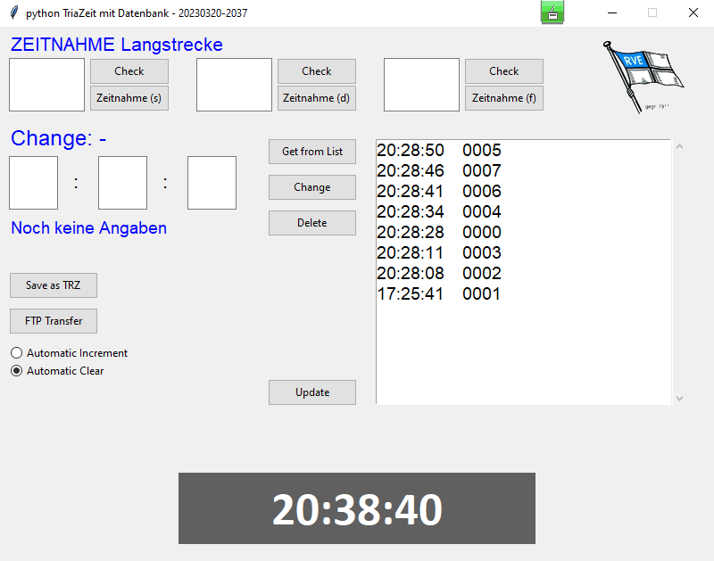

Zeit Modul für die RVE Langstrecke
==================================

Ziel
----

Ziel dieser Anwendung ist es, für die 3 Messpunkte (Start, 3000m und Ziel) eine möglichkeit zu bieten, die Absolute Zeit zu erfassen wann ein Boot die Marke passiert. Die Auswertung der gefahrenen Zeit erfolgt außerhalb dieses Systems.

Konfiguration
-------------

Die Konfiguration wird über die Datei 'RVEZeit.ini' erledigt.

Parameter:

```ini
[DEFAULT]
# Positionen: Start, 3000m, Ziel
Position = Start

[FTP]
# FTP Server connection parameter
Server = fritz.box
User = ftpuser
Password = GeheimesKennwort123!
Directory = /Dokumente

```

Aufruf
------

Die Anwendung wurde unter Python 3.10.3 auf Windows entwickelt und getestet.  
Sie benötigt keine weiteren Module.

Start:

Windows: (Getestet mit Python 3.10.3)

```bat
cd RVEZeitmessung
py main.py

```

Linux: (Getested mit Python 3.7.3 auf Linux armv7l)

```bash
cd RVEZeitmessung
python3 main.py

```

Bedienung
--------

Die Oberfläche sieht so aus:



Funktionen:

* **Check:** Überprüft ob die Bootsnummer links gelegenen Eingabefeld bereits in der Datenbank vorhanden ist. Zahl und Knopf "Zeitnahme" werden rot - bereits vorhenden - oder grün - Noch nicht vorhanden.
* **Zeitnahme:** Überträgt die Bootsnummer vom links gelegenen Eingabefeld in die Datenbank. Falls die Bootsnummer bereits gespeichert ist, wird die vorhandene Zeit überschrieben.  
  Die Übernahme kann ebenfalls durch drücken von _Return_ im Eingabefeld oder durch drücken des entsprechenden Buchstabens _s, d, f_ ausgelöst werden.
* **Get from List:** Übernimmt die selektierte Zeit aus dem Zeitstrahl in die Felder links um die gespeicherte Zeit anzupassen.
* **Change:** Speichert die geänderte Zeit in der Datenbank.
* **Delete:** Löscht die geladene Bootsnummer und Zeit komplett aus der Datenbank.
* **Update:** Aktualisiert die Daten im Zeitstrahl.
* **Save as TRZ:** Speichert die Daten aus dem Zeitstrahl in eine .trz Datei.
* **FTP Transfere:** Speichert die Daten aus dem Zeitstrahl in eine .trz Datei und überträgt die .trz Datei und die Datenbank an den konfigurierten FTP Server.
* **Automatic Increment / Automatic Clear:** Steuert ob die Eingabefelder nach der Zeitübernahme geleert werden (Automatic Clear) oder um 1 erhöht werden (Automatic Increment).
* **Exit:** Die Anwendung kann über das Fenster Schließen Symbol beendet werden.
